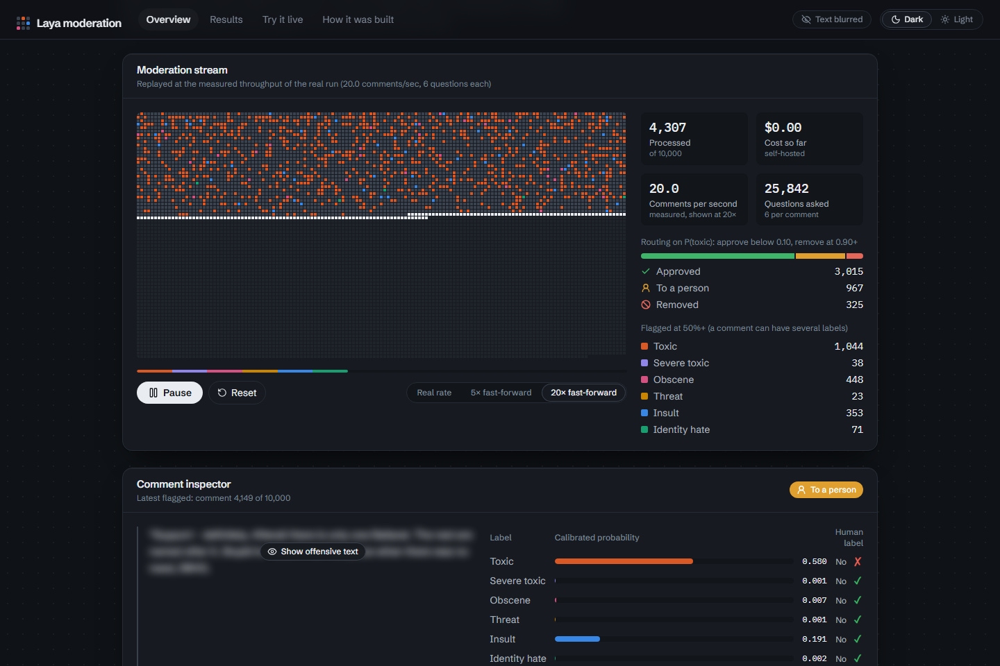
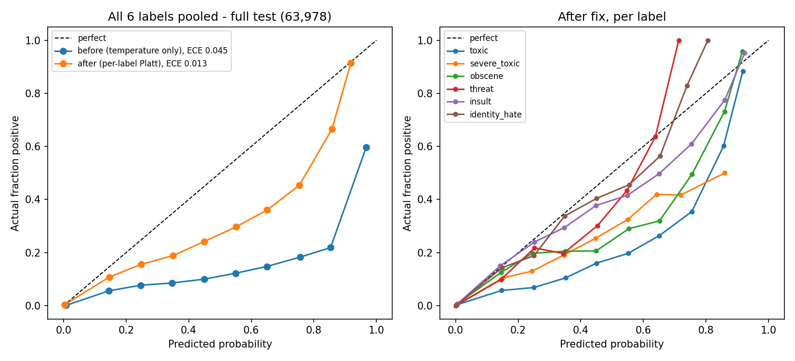
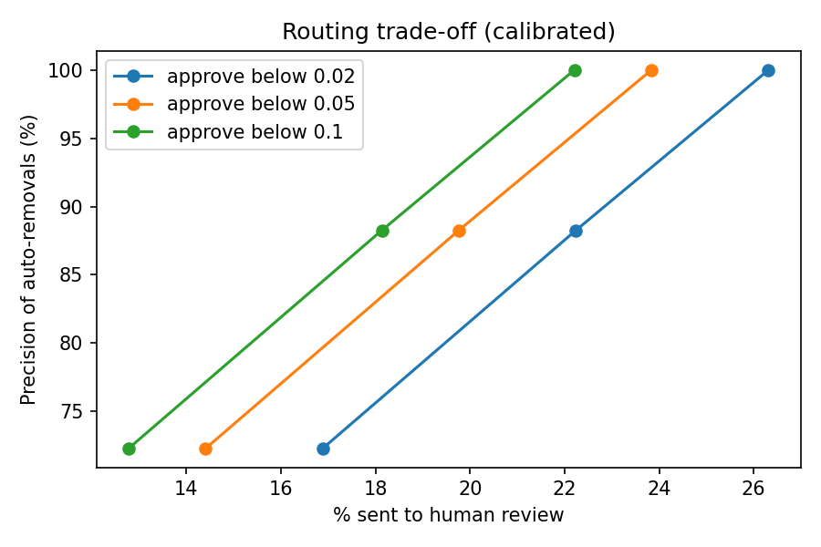

# Laya moderation engine

A 421M-parameter open-source decision model, fine-tuned for free on Kaggle, that scores within 0.001 of Detoxify on the Jigsaw toxic comment benchmark. Its confidence is calibrated, so about 82% of moderation decisions can be automated, at $0 per request.

**[Live demo](https://laya-moderation.vercel.app)** · **[Try it on your own text](https://laya-moderation.vercel.app/try)** · **[Model on Hugging Face](https://huggingface.co/Vinay57/laya-jigsaw-moderation)** · **[Live API](https://huggingface.co/spaces/Vinay57/laya-moderation-demo)**



## Results

ROC-AUC on the full Jigsaw test set of 63,978 comments. ROC-AUC is the chance that a random toxic comment gets a higher score than a random clean one, so 0.5 is a coin flip and 1.0 is perfect.

| Label | TF-IDF + LR | Detoxify (original) | Laya merged (mine) |
|---|---|---|---|
| toxic | 0.9643 | 0.9739 | 0.9726 |
| severe_toxic | 0.9831 | 0.9915 | 0.9887 |
| obscene | 0.9770 | 0.9824 | **0.9828** |
| threat | 0.9920 | 0.9965 | 0.9962 |
| insult | 0.9703 | 0.9805 | **0.9813** |
| identity_hate | 0.9850 | 0.9928 | 0.9902 |
| **mean** | 0.9786 | **0.9863** | 0.9853 |

Laya is within 0.001 of Detoxify on the mean, beats it on obscene and insult, ties on threat, and beats the TF-IDF baseline on every label. On the 54k test comments I never looked at during development it scores 0.9856. For context only, the winning Kaggle entry scored 0.9886, but that was an ensemble of dozens of models, not a single model.

## How I got there

1. **Reproduced the baselines.** My evaluation gave Detoxify 0.9863 against its published 0.9864, which told me the evaluation code was right.
2. **Fine-tuned Laya** on 12,000 balanced comments, each asked all six questions (72,000 examples), for 2 epochs on Kaggle's free 2×T4 GPUs in 2h 12m. Five labels improved. Threat got worse, 0.995 to 0.950 on a 10k sample.
3. **Found why threat dropped.** Rounding the probabilities was my first guess, and re-scoring disproved it. The real cause was two mislabelled or debatable threat comments out of only 34 in the sample.
4. **Merged the two models (WiSE-FT).** Averaging the weights of the original and fine-tuned models gives one model at the same speed. The mix was picked on validation only, with the rule fixed in advance, and 50/50 won with 0.9901.
5. **Fixed hidden overconfidence.** When the model said "97% sure" it was right only about 60% of the time, because the training data was 48% toxic while real comments are about 10%. Per-label Platt scaling (two numbers per label, fitted on validation) cut calibration error from 0.045 to 0.013 without changing any ranking.
6. **Tested it like a product:** a routing policy, an error review, a bias test, a speed trick and a latency race against an LLM API.

## Calibration and routing



After calibration, a "90% or more" prediction is right 88% of the time for toxic, 96% for obscene and 95% for insult. The middle of the range (30% to 80%) is still somewhat overconfident.



With the recommended policy (approve below 0.10, remove at 0.90 or above) on the toxic question:

- 77.8% of comments are approved automatically, and only 0.34% of those were actually toxic
- 4.1% are removed automatically, with 88% precision
- 18.1% go to a person

About 1 in 8 automatic removals was a comment the labellers called clean, so on a real platform I would treat "remove" as "hide until a person checks".

## Bias and robustness

On [HateCheck](https://github.com/paul-rottger/hatecheck-data) (3,728 functional test cases, identity hate question):

| Model | ROC-AUC | Hate caught | Harmless wrongly flagged |
|---|---|---|---|
| Laya zero-shot | 0.847 | 59% | 13.8% |
| Laya merged (uncalibrated, 0.5 threshold) | 0.805 | 62% | 20.6% |
| **Laya merged, calibrated** | 0.805 | 46% | **9.4%** |
| Detoxify | 0.694 | 40% | 17.0% |

Fine-tuning helped with implicit hate (36% to 58% caught) and reclaimed slurs (72% to 89% correctly left alone). It also imported some known Jigsaw bias: plain slurs, negated hate, neutral identity mentions and counter-speech all got worse. All three models struggle with deliberately misspelled hate.

## Speed

| Setup | Hardware | Result |
|---|---|---|
| All six questions | One Kaggle T4 GPU | 20 to 24 comments/sec |
| Two-step check (ask "toxic?" first, the other five only if P(toxic) ≥ 0.10) | One Kaggle T4 GPU | 56.6 comments/sec, mean ROC-AUC 0.9841 |
| One comment at a time, vs Gemini 2.5 Flash over its API | One Kaggle T4 GPU | 76 ms vs 1,840 ms median |
| All six questions | 2 CPU threads | 7.3 s per comment (1.0 s for toxic only) |

Gemini's free tier answered only 22 of 100 requests before its quota ran out, so the race compares latency on those 22 comments only, not accuracy.

## What's in this repo

```
web/        The demo site: Vite, React, TypeScript, Tailwind. Deployed on Vercel.
space/      The live API: Gradio on Hugging Face ZeroGPU, with a CPU fallback.
            server.py and the Dockerfile are a plain FastAPI version for self-hosting.
notebooks/  The six Kaggle notebooks, with their outputs.
data/       The recorded results the site replays and charts.
docs/       Plots and the screenshot above.
```

The site loads only static JSON for everything except "Try it live", which calls the Space. The stream replay draws 10,000 tiles on a canvas, and the charts are hand-built SVG. The Space scores comments exactly the way the notebooks did, and golden tests check that its output matches the recorded GPU run within 0.02 on every label.

## Run it locally

**Site**

```bash
cd web
npm install
cp .env.example .env.local   # points "Try it live" at the public Space
npm run dev                  # http://localhost:5173
npm test
```

**API** (Python 3.12)

```bash
cd space
python -m venv .venv
.venv/Scripts/activate        # on macOS or Linux: source .venv/bin/activate
pip install torch==2.13.0 --index-url https://download.pytorch.org/whl/cpu
pip install -r requirements.txt gradio==6.29.0 fastapi httpx pytest
python app.py                 # Gradio app on http://localhost:7860
pytest                        # golden, API and app tests
```

To self-host the plain REST version instead: `docker build -t laya-api space` then `docker run -p 7860:7860 laya-api`.

## Notebooks

1. [Baselines](notebooks/phase1_baselines.ipynb): TF-IDF, Detoxify and zero-shot Laya
2. [Fine-tuning](notebooks/phase2_finetune.ipynb) on Kaggle's 2×T4 GPUs
3. [Re-scoring](notebooks/phase2b_rescore.ipynb) without rounding, to check the threat drop
4. [WiSE-FT merge](notebooks/phase2c_merge_final.ipynb) and the final test
5. [Evaluation and demo data](notebooks/phase3_eval_demo_data.ipynb): routing, HateCheck, speed, the LLM race
6. [Calibration fix](notebooks/phase3b_calibration_fix.ipynb) with per-label Platt scaling

## Limitations

- Calibrated scores between 30% and 80% are still somewhat overconfident.
- Fine-tuning on Jigsaw imported some identity bias (see the HateCheck results).
- English only, and only tested on Wikipedia talk page comments.
- Hate written with spelling tricks is often missed.
- Some Jigsaw labels are wrong, which caps how well any model can score.
- The live demo runs on free shared hardware: it sleeps when idle and takes a minute or two to wake.
- Answers to your own custom questions are not calibrated.

## Credits

- [Laya](https://huggingface.co/convaiinnovations/laya) by ConvAI Innovations (Apache-2.0)
- [Jigsaw Toxic Comment Classification Challenge](https://www.kaggle.com/c/jigsaw-toxic-comment-classification-challenge) data
- [HateCheck](https://github.com/paul-rottger/hatecheck-data) by Röttger et al. (2021)
- [Detoxify](https://github.com/unitaryai/detoxify) by Unitary

Code released under the [Apache-2.0 licence](LICENSE). Built by [Vinay Purohit](https://www.linkedin.com/in/vinay-purohit-58b3922b8).
